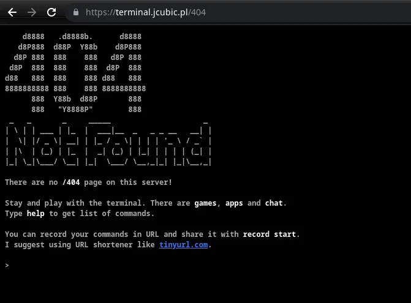

# My Portfolio 💻

## Description
Welcome to my portfolio website! It's a personal page that showcases all of my details, including my skills, certifications, education, and projects. Built with HTML, CSS and JS, this site serves as an online representation of my work and achievements. 🚀

## Features

- Responsive design
- Interactive UI elements
- Project showcase
- Contact form
- Status dashboard showing:
  - Current time (IST)
  - Slack presence
  - Last.fm now playing
- Bot detection
- Mobile detection
- DevTools detection
- Terminal-themed 404 page with interactive games

## Inspiration & Credits

- DevTools detection with glitchy messages inspired by [Max Wofford's portfolio](https://maxwofford.com/)
- Mobile detection implementation based on [Hack Club's no-mobile page](https://github.com/hackclub/marketplace/blob/8c03f02a54739a699fd63f5a8311b5ca83a9db6f/src/routes/no-mobile/%2Bpage.svelte#L6)
- Status dashboard (time, Slack, Last.fm) inspired by [Jeremy Woolley's portfolio](https://jeremywoolley.com/)
- Terminal-themed 404 page inspired by [this Reddit post](https://www.reddit.com/r/terminal_porn/comments/yeyp6j/terminalthemed_404_error_page/?utm_source=share&utm_medium=web3x&utm_name=web3xcss&utm_term=1&utm_content=share_button)

## Technologies Used 🛠️
I've used the following technologies to build my portfolio:

- **HTML** 
- **CSS** 
- **JS** 
- **Bootstrap 5**
- **Typed.js for typing animations**
- **Web3Forms for contact form**
- **My Custom API for status dashboard running via cloudflare workers**

## Website 🌐
You can view my live portfolio at:  
[https://sdheeraj.is-a.dev](https://sdheeraj.is-a.dev) 🔗

## Screenshot 📸
Here's a preview of my portfolio website:  

## 404 page
Inspired by a [redditor/developer](https://www.reddit.com/r/terminal_porn/comments/yeyp6j/terminalthemed_404_error_page/?utm_source=share&utm_medium=web3x&utm_name=web3xcss&utm_term=1&utm_content=share_button)

I have added many games,etc which are terminal themed

## Contributing 🤝
If you want to contribute and make improvements, your welcome to fork the repository, create a branch, and submit a pull request! Let's collaborate and expand my portfolio. 😊

## Contact

For any queries, reach out to me at contact@sdheeraj.is-cool.dev
